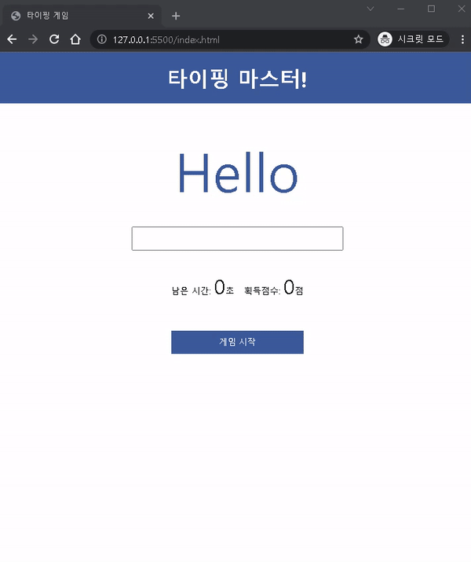

# 작성일: 2022년 2월 23일(수)

1. <https://www.youtube.com/watch?v=_CsGSE5gwTA&list=PLpJDjPqxGWGrSGPUBqWlsJlcLF_grNClK&index=1>

2. Vanilla 자바스크립트 타자게임 만들기! 실전코스

3. 사용 기술: HTML, CSS, JS

4. 단어 api 사용: <https://random-word-api.herokuapp.com/word?number=100>

5. 

6. <https://hyundai-sangho.github.io/TypingGame_js/>
